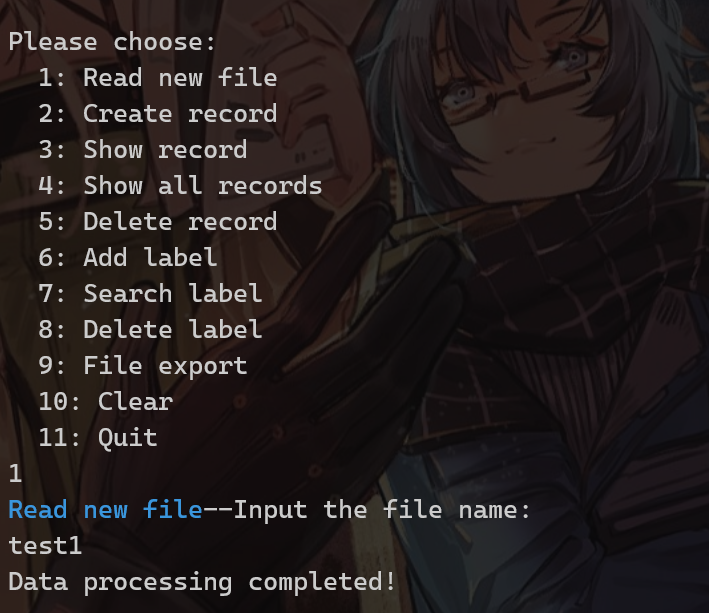
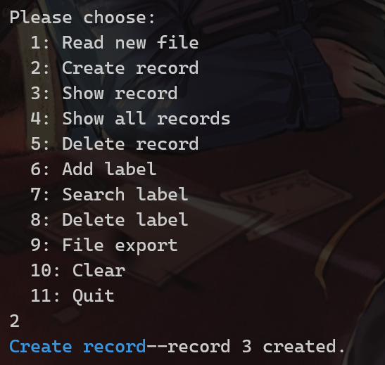
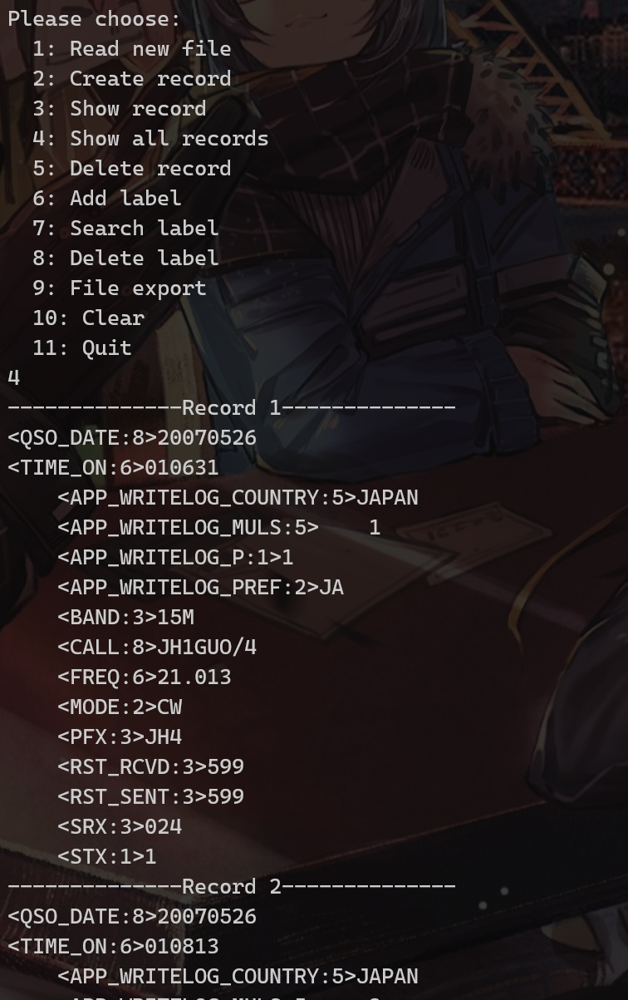
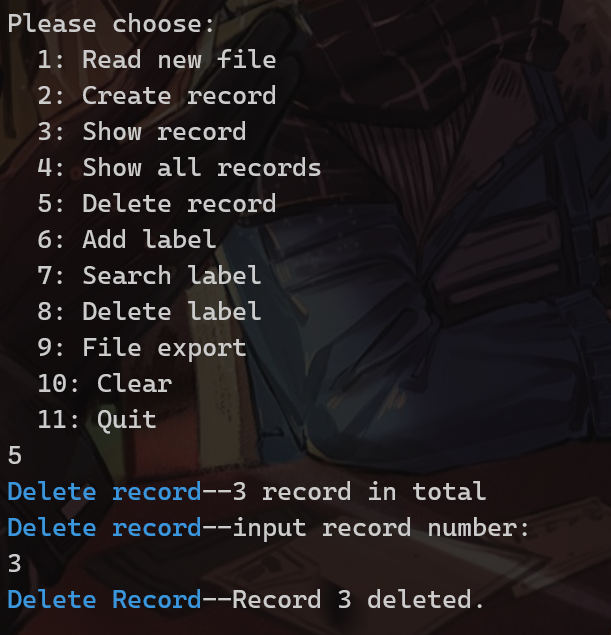
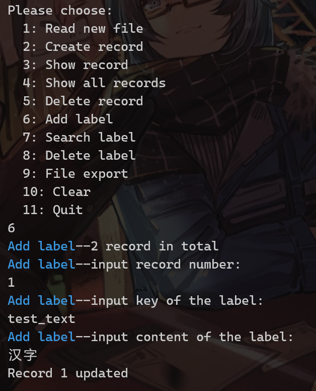
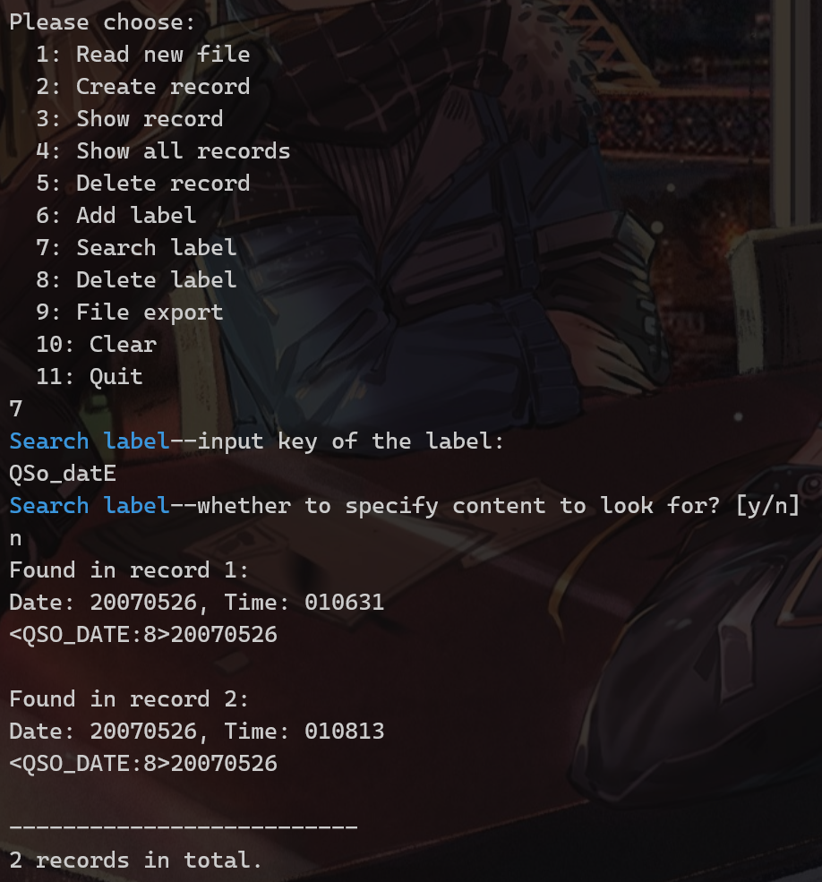
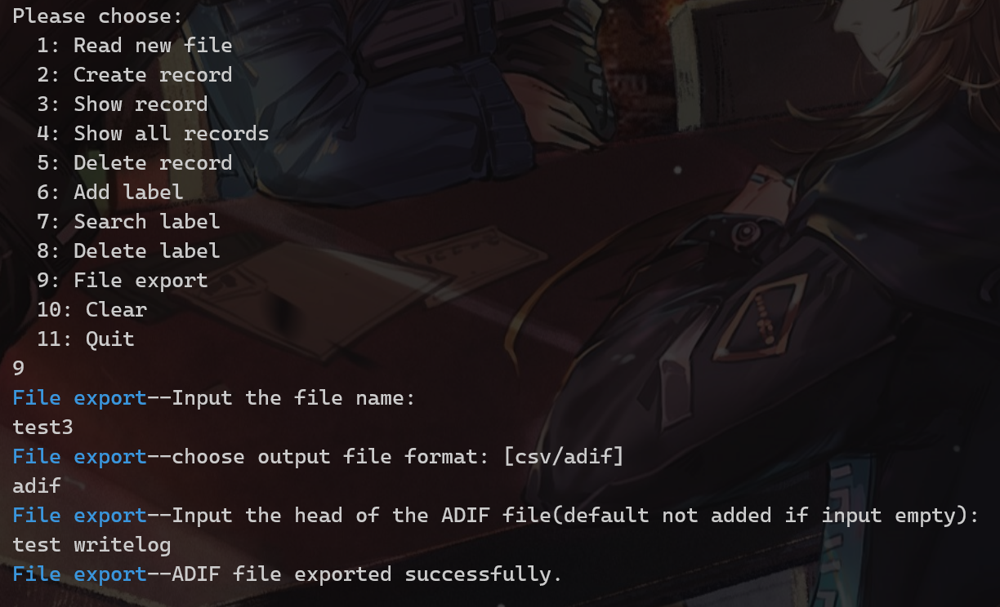

# ADIF 数据处理程序

作者：朱熙哲

学号：3220103361

班级：图灵2202

日期：2024-05-31

## 题目要求

设计并实现一个命令行程序，该程序能够读取ADIF格式的文件，解析其中的数据，并提供基本的数据操作功能。

## 题目分析

一个 ADIF 文件是一个文本文件，其中包含了一系列的 QSO 记录。每一条 QSO 记录包含了一次通信的信息，包括通信时间、对方呼号、频率、模式等，由多个字段构成。以下为相关分析：

1. 一个字段使用一个结构体定义，一条记录使用一个类定义，所有记录的指针存在全局变量当中。
2. 分别将功能函数、辅助函数、类定义函数、主函数放在不同的文件中。
3. 用户界面使用命令行，重复执行。
4. 需要检测用户输入的合法性，进行大写转换。输出错误信息。

## 数据结构设计

### 类的定义

`struct Recording`：

- 字段的结构体，包含一条字段的标签、内容、字段长度和合法性。
- 重载了赋值号、相等比较、标准流输出与文件流输出。

```c++
struct Recording
{
    Recording();
    int length;
    std::string field;
    std::string id;
    bool valid;
    ~Recording();

    Recording& operator=(const Recording &rec);
    bool operator==(const Recording &rec);
    friend std::ofstream& operator<<(std::ofstream& file, Recording& record); 
    friend std::ostream& operator<<(std::ostream& out, Recording& record); 
};
```

`class RecordingSet`：

- 记录的类，使用 `<map>` 存储每个字段的标签和字段内容。
- 实现添加、删除、查找、显示、导出功能。
- 重载相等比较，比较主键是否一致。

```c++
class RecordingSet
{
private:
    std::map<std::string, Recording> recordings;
    int num_recordings;
public:
    Recording date; // store main key--QSO_DATE
    Recording time; // store main key--TIME_ON
    bool operator==(const RecordingSet &recSet);
    RecordingSet();
    void AddRecording(std::string id, Recording recording);
    bool RemoveRecording(std::string id);
    Recording GetRecording(std::string id);
    void Show();
    bool CheckDate();
    bool CheckTime();
    void ExportToCSV(std::ofstream &outfile);
    void ExportToADIF(std::ofstream &outfile);
    ~RecordingSet();
};
```

### 全局变量

`std::vector <RecordingSet*> g_recordingSets`：

- 用 `<vector>` 存储所有记录的指针，便于指示记录编号。

## 功能设计与实现

### 用户接口函数

```c++
RecordingSet* CreateRecord();

void Search(std::string id, std::string field);
void Search(std::string id);

void Update(int index, std::string id, std::string field);

void Delete(int index);
void Delete(int index, std::string id);

void ShowRecord();
void ShowRecord(int index);
void ShowMenu();

std::string InputHead();
std::string InputFileName();
void ExportADIF(std::string filename, std::string head);
void ExportADIF(std::string filename);
void ExportCSV(std::string filename);

void ignoreLine();
```

- `CreateRecord()`：使用 `new RecordingSet()` 创建一条空记录放在 `g_recordingSets` 的末尾。
- `Search()`：根据标签在 `<map>` 中查找记录，可选是否指定字段内容，因此有一个重载。
- `Update()`：根据记录编号和标签更新记录的一条字段，包括新增或者覆盖。
- `Delete()`：根据记录编号删除记录，可选是否指定标签。
- `ShowRecord()`：显示所有记录或者指定记录。
- `ShowMenu()`：显示用户菜单。
- `InputHead()`：输入 ADIF 文件头。
- `InputFileName()`：输入文件名。
- `ExportADIF()`：导出 ADIF 文件，可选是否指定文件头。如果文件存在则覆盖，否则创建并写入。
- `ExportCSV()`：导出 CSV 文件。
- `ignoreLine()`：清空标准输入流，用于处理用户的错误输入导致 `std::cin` 关闭。

具体实现放在附录当中。

### 辅助函数

```c++
#define VALID 0             // valid label
#define EOH 1               // B-type label EOH
#define EOR 2               // B-type label EOR
#define A_LABEL_INVALID 3   // A-type invalid label
#define LENGTH_INVALID 4    // A-type invalid length
#define B_LABEL_INVALID 5   // B-type invalid label

#define ERROR(a) std::cerr << "\033[31m" << "Error: " << "\033[0m" << a << std::endl
#define WARNING(a) std::cerr << "\033[33m" << "Warning: " << "\033[0m" << a << std::endl
#define INFO(a, b) std::cout << "\033[36m" << a << "\033[0m" << "--" << b << std::endl

#define MAINKEYMISSING 0

int CheckLabel(std::string rec);
int CheckMainKey(RecordingSet *recSet);
bool CheckID(std::string id);
bool CheckLength(std::string len);
bool CheckHead(std::string head);
bool CheckFileName(std::string name);

int GetField(std::string log, int start, int len);
int GetFieldLen(std::string field);

Recording* SearchRecording(RecordingSet *recSet, std::string id);
void UpdateRecording(RecordingSet *recSet, std::string id, std::string field);
void HandleDumpMainKey(RecordingSet *recSet, int index);

std::string ToUp(std::string &str);
std::string ToLow(std::string &str);
```

- 宏定义：定义了一些常量，用于标识对输入文件每条字段的解析结果；定义了一些输出颜色，用于区分错误、警告、通知输出。
- `CheckLabel()`：检查一条字段 `<A:n>` 或 `<B>` 是否合法。
- `CheckMainKey()`：检查主键是否缺失。
- `CheckID()`：检查字段类型 `<A:n>` 中的标识符 `A` 是否合法。
- `CheckLength()`：检查字段类型 `<A:n>` 中的长度 `n` 是否合法。
- `CheckHead()`：检查文件头是否合法。
- `CheckFileName()`：检查文件名是否合法。
- `GetField()`：从输入文本中获取一条字段的内容，实现了根据声明长度解析 `UTF-8` 编码的汉字字符功能
- `GetFieldLen()`：获取字段的长度，会将占 3 bytes 的汉字字符视为 2 个字符。
- `SearchRecording()`：在一条记录中查找指定标签的字段。
- `UpdateRecording()`：更新一条记录中指定标签的字段。
- `HandleDumpMainKey()`：处理主键重复的情况，询问用户是否覆盖。
- `ToUp()`：将字符串转换为大写。
- `ToLow()`：将字符串转换为小写。

### 数据处理函数

```c++
std::string ReadFile(std::string name);
void DataSplit(std::string log);
```

- `ReadFile()`：根据输入的文件名（文件名不需包含后缀）读取文件内容，返回文件内容的字符串。如果文件不存在
- `DataSplit()`：根据 `<>` 匹配标签，调用 `CheckLabel()` 检查标签合法性，合法则将该字段写入记录，遇到 `<EOR>` 则将该条记录存入 `g_recordingSets` 并新建一条记录。

## 相关设计展示

- 读取文件内容并解析：

{:width="300px"}

- 创建新纪录：

{:width="300px"}

- 展示记录：

{:width="300px"}

- 删除记录：

{:width="300px"}

- 添加字段：

{:width="300px"}

- 搜索标签：

{:width="300px"}

- 导出文件：

{:width="300px"}

## 附录

### ADIF.cpp

```c++
/**
*****************************************************************************
*
*  @file    ADIF.cpp
*  @brief   Main function of the program. Interactive interface.
*
*  @author  Xizhe Zhu (3220103361@zju.edu.cn)
*  @date    2024-05-31
*
*  @copyright Copyright (c) 2024
*
-----* encoding: UTF-8 *-----
*****************************************************************************
*/
#include <iostream>

#include "Recording.h"
#include "DataProcess.h"
#include "UserAPI.h"
#include "Helper.h"

// Global; Store all records
std::vector<RecordingSet *> g_recordingSets;

int main()
{
    
    while (true)
    {
        ShowMenu();
        int choice;
        std::cin >> choice; //input choice index in menu
        int index;
        switch (choice)
        {
        case 1: // Read new file
        {
            INFO("Read new file", "Input the file name:");
            std::string filename = InputFileName();
            if (filename == "")
            {
                break;
            }
            std::string log = ReadFile(filename);
            DataSplit(log);
            break;
        }
        case 2: // Create new record
        {
            CreateRecord();
            break;
        }
        case 3: // Show a record
        {
            INFO("Show record", g_recordingSets.size() << " record in total");
            INFO("Show record", "input record number:");
            std::cin >> index;
            ShowRecord(index);
            break;
        }
        case 4: // Show all records
        {
            ShowRecord();
            break;
        }
        case 5: // delete a record
        {
            INFO("Delete record", g_recordingSets.size() << " record in total");
            INFO("Delete record", "input record number:");
            std::cin >> index;
            Delete(index);
            break;
        }
        case 6: // Add a label in a record
        {
            std::string id;
            std::string field;
            INFO("Add label", g_recordingSets.size() << " record in total");
            INFO("Add label", "input record number:");
            std::cin >> index;
            INFO("Add label", "input key of the label:");
            std::cin >> id;
            INFO("Add label", "input content of the label:");
            std::cin >> field;
            Update(index, id, field);
            break;
        }
        case 7: // Search a label
        {
            std::string id;
            std::string field;
            std::string choice;
            INFO("Search label", "input key of the label:");
            std::cin >> id;
            INFO("Search label", "whether to specify content to look for? [y/n]");
            while (std::cin >> choice)
            {
                ToUp(choice);
                if (choice == "Y" || choice == "YES")
                {
                    INFO("Search label", "input content to look for:");
                    std::cin >> field;
                    Search(id, field);
                }
                else if (choice == "N" || choice == "NO")
                {
                    Search(id);
                    break;
                }
                else
                {
                    ERROR("Invalid input.");
                    INFO("Search label", "whether to specify content to look for? [y/n]");
                }
            }
            break;
        }
        case 8: // Delete a label
        {
            std::string id;
            INFO("Delete label", g_recordingSets.size() << " record in total");
            INFO("Delete label", "input record number:");
            std::cin >> index;
            INFO("Delete label", "input key of the label:");
            std::cin >> id;
            Delete(index, id);
            break;
        }
        case 9: // Export to ADIF file or CSV file
        {
            INFO("File export", "Input the file name:");
            std::string filename = InputFileName();
            if (filename == "")
            {
                break;
            }
            INFO("File export", "choose output file format: [csv/adif]");
            std::string format;
            std::cin >> format;
            ToLow(format);
            if(format == "adif")
            {
                INFO("File export", "Input the head of the ADIF file(default not added if input empty): ");
                std::string head = InputHead();
                if (head == "")
                {
                    ExportADIF(filename);
                }
                else
                {
                    ExportADIF(filename, head);
                }
                break;
            }
            else if(format == "csv")
            {
                ExportCSV(filename);
                break;
            }
            else
            {
                ERROR("Invalid data format.");
                break;
            }

        }
        case 10: // Clear all records
        {
            int size = g_recordingSets.size();
            for (int i = 0; i < size; i++)
            {
                delete g_recordingSets[0];
                g_recordingSets.erase(g_recordingSets.begin());
            }

            INFO("Clear", "all records deleted.");
            break;
        }
        case 11: // Quit
        {
            return 0;
        }
        default:
            break;
        }

        if (!std::cin)          // input error 
        {
            if (std::cin.eof())
            {
                exit(0);
            }
            std::cin.clear();  // reset cin state
            ignoreLine();      // clear stdin
        }
    }
}
```

### UserAPI.cpp

```c++
/**
 * @file UserAPI.cpp
 * @author Xizhe Zhu (3220103361@zju.edu.cn)
 * @brief User interface functions
 * @date 2024-05-31
 * 
 * @copyright Copyright (c) 2024
 * 
 */

#include "UserAPI.h"

#include <string>
#include <vector>
#include <iostream>
#include <fstream>
#include <limits>
#include "Recording.h"
#include "Helper.h"


RecordingSet *CreateRecord()
{
    RecordingSet *recSet = new RecordingSet();
    g_recordingSets.push_back(recSet);
    INFO("Create record", "record " << g_recordingSets.size() << " created.");
    return recSet;
}


/**
 * @brief input head message when exporting ADIF file
 * @return head message
*/
std::string InputHead()
{
    std::string head;
    ignoreLine();
    std::getline(std::cin, head); // 
    if (CheckHead(head))
    {
        return head;
    }
    else
    {
        ERROR("Invalid head.");
        return "";
    }
}

/**
 * @brief input file name when exporting ADIF or CSV file
 * 
 * @return file name
 */
std::string InputFileName()
{
    std::string fileName;
    ignoreLine();
    std::getline(std::cin, fileName);
    if (CheckFileName(fileName))
    {
        return fileName;
    }
    else if(fileName == ""){
        ERROR("Empty filename.");
        return "";
    }
    else
    {
        ERROR("Invalid filename.");
        return "";
    }
}

/**
 * @brief search label with given field in all records
 */
void Search(std::string id, std::string field)
{
    ToUp(id);
    ToUp(field);
    int totalNum = 0;
    for (int i = 0; i < g_recordingSets.size(); i++)
    {
        Recording *rec = SearchRecording(g_recordingSets[i], id);
        if (rec->field == field)
        {
            std::cout << "Found in record " << i + 1 << ':' << std::endl;
            std::cout << "Date: " << g_recordingSets[i]->date.field << ", Time: " << g_recordingSets[i]->time.field << std::endl;
            std::cout << *rec << std::endl;
            std::cout << std::endl;
            totalNum++;
        }
    }
    if (totalNum == 0)
    {
        WARNING("Not found!");
    }
    else
    {
        std::cout << "--------------------------" << std::endl;
        std::cout << totalNum << " records in total." << std::endl;
    }
}
/**
 * @brief search label in all records
 */
void Search(std::string id)
{
    ToUp(id);
    int totalNum = 0;
    for (int i = 0; i < g_recordingSets.size(); i++)
    {
        Recording *rec = SearchRecording(g_recordingSets[i], id);
        if (rec->valid)
        {
            std::cout << "Found in record " << i + 1 << ':' << std::endl;
            std::cout << "Date: " << g_recordingSets[i]->date.field << ", Time: " << g_recordingSets[i]->time.field << std::endl;
            std::cout << *rec << std::endl;
            std::cout << std::endl;
            totalNum++;
        }
    }
    if (totalNum == 0)
    {
        WARNING("Not found!");
    }
    else
    {
        std::cout << "--------------------------" << std::endl;
        std::cout << totalNum << " records in total." << std::endl;
    }
}

void Update(int index, std::string id, std::string field)
{
    RecordingSet *recSet;
    if (index > g_recordingSets.size() || index < 1)
    {
        ERROR("Record does not exist.");
        return;
    }
    recSet = g_recordingSets[index - 1];
    UpdateRecording(recSet, id, field);
    std::cout << "Record " << index << " updated" << std::endl;
}

void Delete(int index)
{
    if (index > g_recordingSets.size() || index < 1)
    {
        ERROR("Record does not exist.");
        return;
    }
    delete g_recordingSets[index-1];
    g_recordingSets.erase(g_recordingSets.begin() + index - 1);
    INFO("Delete Record", "Record " << index << " deleted.");
}

void Delete(int index, std::string id)
{
    if (index > g_recordingSets.size() || index < 1)
    {
        ERROR("Record does not exist.");
        return;
    }
    ToUp(id);
    RecordingSet *recSet = g_recordingSets[index - 1];
    if (!recSet->RemoveRecording(id))
    {
        ERROR("Label " << id << " not found.");
        return;
    }
    INFO("Delete label", "Label " << id << " deleted.");
    return;
}

/**
 * @brief show all records
 * 
 */
void ShowRecord()
{
    int i = 1;
    for (auto recSet : g_recordingSets)
    {
        std::cout << "--------------Record " << i++  << "--------------" << std::endl;
        recSet->Show();
    }
    std::cout << "--------------------------" << std::endl;
}
/**
 * @brief show a record
 * 
 * @param index record number
 */
void ShowRecord(int index)
{
    if (index > g_recordingSets.size() || index < 1)
    {
        ERROR("Record does not exist.");
        return;
    }
    std::cout << "--------------Record " << index  << "--------------" << std::endl;
    g_recordingSets[index - 1]->Show();
}

void ShowMenu()
{
    std::cout << std::endl;
    std::cout << "Please choose:" << std::endl;
    std::cout << "  1: Read new file" << std::endl;
    std::cout << "  2: Create record" << std::endl;
    std::cout << "  3: Show record" << std::endl;
    std::cout << "  4: Show all records" << std::endl;
    std::cout << "  5: Delete record" << std::endl;
    std::cout << "  6: Add label" << std::endl;
    std::cout << "  7: Search label" << std::endl;
    std::cout << "  8: Delete label" << std::endl;
    std::cout << "  9: File export" << std::endl;
    std::cout << "  10: Clear" << std::endl;
    std::cout << "  11: Quit" << std::endl;

}

void ExportADIF(std::string filename, std::string head)
{
    std::ofstream outfile;
    filename = "dataset/" + filename + ".adi";
    outfile.open(filename, std::ios::out);
    if(!outfile.is_open()){
        ERROR("File cannot be opened.");
        return;
    }
    outfile << head << std::endl;
    outfile << "<EOH>" << std::endl;
    for(auto rec: g_recordingSets){
        rec->ExportToADIF(outfile);
    }
    outfile.close();
    INFO("File export", "ADIF file exported successfully.");
}

void ExportADIF(std::string filename)
{
    std::ofstream outfile;
    filename = "dataset/" + filename + ".adi";
    outfile.open(filename, std::ios::out);
    if(!outfile.is_open()){
        ERROR("File cannot be opened.");
        return;
    }
    for(auto rec: g_recordingSets){
        rec->ExportToADIF(outfile);
    }
    outfile.close();
    INFO("File export", "ADIF file exported successfully.");
}

void ExportCSV(std::string filename)
{
    std::ofstream outfile;
    filename = "dataset/" + filename + ".csv";
    outfile.open(filename, std::ios::out);
    if(!outfile.is_open()){
        ERROR("File cannot be opened.");
        return;
    }
    for(auto rec: g_recordingSets){
        rec->ExportToCSV(outfile);
    }
    outfile.close();
    INFO("File export", "CSV file exported successfully.");
}

/**
 * @brief Clear the standard input stream
 * 
 */
void ignoreLine()
{
    std::cin.ignore(std::numeric_limits<std::streamsize>::max(), '\n');
}
```

### Helper.cpp

```c++
/**
 * @file Helper.cpp
 * @author Xizhe Zhu (3220103361@zju.edu.cn)
 * @brief Auxiliary function
 * @date 2024-05-31
 * 
 * @copyright Copyright (c) 2024
 * 
 */

#include "Helper.h"

#include <string>
#include <iostream>

#include "Recording.h"

/**
 * @brief Check label type; Check for invalid reasons
 * 
 * @param label 
 * @return flag for label type or invalid reasons
 */
int CheckLabel(std::string label)
{
    if (label == "EOH")
    {
        return EOH;
    }
    else if (label == "EOR")
    {
        return EOR;
    }

    int pos = label.find(':');
    if (pos != std::string::npos)
    {
        std::string id = label.substr(0, pos);
        if (!CheckID(id))
            return A_LABEL_INVALID;

        std::string len_str = label.substr(pos + 1, label.length() - pos - 1);
        if (!CheckLength(len_str))
            return LENGTH_INVALID;
    }
    else
    {
        return B_LABEL_INVALID;
    }

    return VALID;
}

/**
 * @brief Get field of a label from log. 
 * Handle the mismatch between the length of Chinese characters and that of the field.
 * 
 * @param log pending log
 * @param start next char after the label
 * @param len declared length in label
 * @return true length after handling Chinese characters
 */
int GetField(std::string log, int start, int len)
{
    int char_num = 0; // increase by 1 for a ascii character, and by 2 for a Chinese character 
    int i = start;
    int ch_flag = 0;

    for (; char_num < len; i++)
    {
        unsigned char c = static_cast<unsigned char>(log[i]);
        if (i > log.length() || c < ' ' || c == 127) // invalid control char
        {
            return -1;
        }
        if (c > 127)  // One Chinese character encoded in utf-8 takes 3 bytes, but length 2 for ADIF file.
        {
            ch_flag++;
            if (ch_flag % 3 == 0 && ch_flag != 0)
            {
                char_num += 2;
            }
            continue;
        }
        char_num++;
    }
    if (char_num > len)
    {
        return -1;
    }
    return i;
}
/**
 * @brief Get the length of a field.
 * Analyze the Chinese character.
 * 
 * @param field 
 * @return field length
 */
int GetFieldLen(std::string field)
{
    int len = 0;
    int ch_flag = 0;
    for (int i = 0; i < field.length(); i++)
    {
        unsigned char c = static_cast<unsigned char>(field[i]);
        if (c < ' ' || c == 127)
        {
            return -1;
        }
        if (c > 127)
        {
            ch_flag++;
            if (ch_flag % 3 == 0 && ch_flag != 0)
            {
                len += 2;
            }
            continue;
        }
        len++;
    }
    if (ch_flag % 3 != 0)
    {
        return -1;
    }
    return len;
}
/**
 * @brief Check that the identifier `A` in the field type `<A:n>` is legal.
 */
bool CheckID(std::string id)
{
    if (id == "")
        return false;
    for (int i = 0; i < id.length(); i++)
    {
        if (id[i] < '!' || id[i] > '~')
            return false;
    }
    return true;
}

bool CheckLength(std::string len)
{
    if (len == "")
        return false;
    for (int i = 0; i < len.length(); i++)
    {
        if (isdigit(len[i]) == 0)
            return false;
    }
    if (std::stoi(len) > 100)
        return false;
    return true;
}

/**
 * @brief 
 * 
 * @param recSet 
 * @return 0 if missing main key "QSO_DATE" or "TIME_ON"; record number if duplicated; -1 if valid.
 */
int CheckMainKey(RecordingSet *recSet)
{
    if (!recSet->CheckDate() || !recSet->CheckTime())
    {
        return MAINKEYMISSING;
    }
    for (int i = 0; i < g_recordingSets.size(); i++)
    {
        RecordingSet *rec = g_recordingSets[i];
        if (*rec == *recSet)
            return i + 1;
    }
    return -1;
}

/*******
 * @brief convert string to uppercase
 * @param str: string to convert
 * @return uppercase string
 ********/
std::string ToUp(std::string &str)
{
    for (int i = 0; i < str.size(); i++)
    {
        if (str[i] >= 'a' && str[i] <= 'z')
        {
            str[i] -= 32;
        }
    }
    return str;
}

/*******
 * @brief convert string to lowercase
 * @param str: string to convert
 * @return lowercase string
 ********/
std::string ToLow(std::string &str)
{
    for (int i = 0; i < str.size(); i++)
    {
        if (str[i] >= 'A' && str[i] <= 'Z')
        {
            str[i] -= 32;
        }
    }
    return str;
}

Recording *SearchRecording(RecordingSet *recSet, std::string id)
{
    ToUp(id);
    Recording *rec = new Recording();
    *rec = recSet->GetRecording(id);
    return rec;
}

void UpdateRecording(RecordingSet *recSet, std::string id, std::string field)
{
    ToUp(id);
    ToUp(field);
    if (!CheckID(id))
    {
        ERROR("id " << id << " invalid");
        return;
    }
    int len = GetFieldLen(field);
    if (len < 0 || len > 100)
    {
        ERROR("field" << field << " invalid");
        return;
    }
    else if (len == 0)
    {
        WARNING("Input field empty");
    }

    Recording rec;
    rec.id = id;
    rec.length = len;
    rec.field = field;
    rec.valid = true;
    recSet->AddRecording(id, rec);
    return;
}

void HandleDumpMainKey(RecordingSet *recSet, int index)
{
    std::cout << recSet->date << " " << recSet->time << std::endl;
    WARNING("New record has duplicate main key. If covered? [y/n]");
    std::string choice;

    while (std::cin >> choice)
    {
        ToUp(choice);
        if (choice == "Y" || choice == "YES")
        {
            delete g_recordingSets[index-1];
            g_recordingSets.erase(g_recordingSets.begin() + index - 1);
            g_recordingSets.push_back(recSet);
            break;
        }
        else if (choice == "N" || choice == "NO")
        {
            break;
        }
        else
        {
            ERROR("Invalid input.");
            WARNING("New record has duplicate main key. If covered? [y/n]");
        }
    }
    return;
}

bool CheckHead(std::string head)
{
    for (int i = 0; i < head.size(); i++)
    {
        if (head[i] == '<')
        {
            return false;
        }
    }
    return true;
}
bool CheckFileName(std::string name)
{
    for (int i = 0; i < name.size(); i++)
    {
        char c = name[i];
        if (isalnum(c) == 0)
        {
            if (c == '_')
            {
                continue;
            }
            else
            {
                return false;
            }
        }
    }
    return true;
}
```

### DataProcess.cpp

```c++
/**
 * @file DataProcess.cpp
 * @author Xizhe Zhu (3220103361@zju.edu.cn)
 * @brief ADIF text processing functions
 * @date 2024-05-31
 * 
 * @copyright Copyright (c) 2024
 * 
 */

#include "DataProcess.h"

#include <fstream>
#include <map>
#include <set>
#include <vector>
#include <iostream>
#include <cctype>
#include <algorithm>
#include <string>

#include "Recording.h"
#include "Helper.h"
/*******
 * @brief read log from ADIF file
 * @param name: file name
 * @return file text
 ********/
std::string ReadFile(std::string name)
{
    std::fstream file;
    std::string path = "dataset/" + name + ".adi";
    file.open(path, std::ios::in);
    if (!file.is_open())
    {
        ERROR("File not found");
        return "";
    }

    std::string log;
    std::string line;
    while (getline(file, line))
    {
        log += line + "\n";
    }
    file.close();
    return log;
}

/*******
 * @brief split log into records and labels
 * @param log: file text
 ********/
void DataSplit(std::string log)
{
    ToUp(log);
    RecordingSet *recSet = new RecordingSet();
    bool one_head = false;
    while (log.length() > 0)
    {
        int lpos = log.find("<");
        int rpos = log.find(">", lpos);
        if (lpos == std::string::npos || rpos == std::string::npos)
        {
            break;
        }
        std::string rec = log.substr(lpos + 1, rpos - lpos - 1);
        std::string label = log.substr(lpos, rpos - lpos + 1);
        int flag = CheckLabel(rec);
        switch (flag)
        {
        case EOH:
        {
            log = log.substr(rpos + 1, log.length() - rpos - 1);
            if(one_head){
                ERROR("Duplicate <EOH>");
            }
            one_head = true;
            break;
        }
        case EOR:
        {
            log = log.substr(rpos + 1, log.length() - rpos - 1);
            int keyFlag = CheckMainKey(recSet);
            int recNum = g_recordingSets.size() + 1;
            if (keyFlag == MAINKEYMISSING)
            {
                WARNING("Record " << recNum << " missing main key!");
            }
            else if (keyFlag > 0)
            {
                HandleDumpMainKey(recSet, keyFlag);
                recSet = new RecordingSet();
                break;
            }
            g_recordingSets.push_back(recSet);
            recSet = new RecordingSet();
            break;
        }
        case VALID:
        {
            int pos = rec.find(':');
            std::string id = rec.substr(0, pos);
            int len = std::stoi(rec.substr(pos + 1, rec.length() - pos - 1));

            int start = rpos + 1;
            int end = GetField(log, start, len);

            if (end == -1)
            {
                WARNING("Label " << label << " field has invalid char.");
                log = log.substr(rpos + 1, log.length() - rpos - 1);
                break;
            }
            std::string field = log.substr(start, end - start);

            Recording recording;
            recording.length = len;
            recording.field = field;
            recording.valid = true;
            recording.id = id;
            recSet->AddRecording(id, recording);
            log = log.substr(end, log.length() - end);
            break;
        }
        case A_LABEL_INVALID:
        {
            WARNING("Label " << label << " id invalid.");
            log = log.substr(rpos + 1, log.length() - rpos - 1);
            break;
        }
        case LENGTH_INVALID:
        {
            WARNING("Label " << label << " length invalid.");
            log = log.substr(rpos + 1, log.length() - rpos - 1);
            break;
        }
        case B_LABEL_INVALID:
        {
            WARNING("Label " << label << " invalid");
            log = log.substr(rpos + 1, log.length() - rpos - 1);
            break;
        }
        default:
            break;
        }
    }
    if(std::find(g_recordingSets.begin(), g_recordingSets.end(), recSet) == g_recordingSets.end()){
        delete recSet;
    }
    std::cout << "Data processing completed!" << std::endl;
}
```

### Recording.cpp

```c++
/**
 * @file Recording.cpp
 * @author Xizhe Zhu (3220103361@zju.edu.cn)
 * @brief Recording struct and RecordingSet class definition and implementation
 * @date 2024-05-31
 * 
 * @copyright Copyright (c) 2024
 * 
 */

#include "Recording.h"

#include <string>
#include <map>
#include <set>
#include <vector>
#include <iostream>
#include <fstream>
#include <cctype>

#include "DataProcess.h"
#include "Helper.h"

Recording::Recording()
{
    this->length = 0;
    this->field = "";
    this->valid = false;
    this->id = "";
}

Recording& Recording::operator=(const Recording &rec)
{
    this->length = rec.length;
    this->field = rec.field;
    this->valid = rec.valid;
    this->id = rec.id;
    return *this;
}

/**
 * @brief Output the recording as ADIF format to a file stream.
 */
std::ofstream& operator<<(std::ofstream& file, Recording& record) 
{
    file << '<' << record.id << ':' << record.length << '>' << record.field;
    return file;
}

/**
 * @brief Output the recording as ADIF format to a standard output stream.
 */
std::ostream& operator<<(std::ostream& out, Recording& record)
{
    out << '<' << record.id << ':' << record.length << '>' << record.field;
    return out;
}

bool Recording::operator==(const Recording &rec)
{
    if(this->length != rec.length || this->field != rec.field || this->valid != rec.valid || this->id != rec.id){
        return false;
    }
    return true;
}
Recording::~Recording()
{
    this->valid = false;
}

RecordingSet::RecordingSet()
{
    this->num_recordings = 0;
    this->recordings.clear();
    this->date = Recording();
    this->time = Recording();
}

RecordingSet::~RecordingSet()
{
    this->recordings.clear();
}

void RecordingSet::AddRecording(std::string id, Recording recording)
{
    ToUp(id);
    if(id == "QSO_DATE"){
        this->date = recording;
    }
    else if(id == "TIME_ON"){
        this->time = recording;
    }
    else{
        this->recordings[id] = recording;
    }
    this->num_recordings++;
}

bool RecordingSet::RemoveRecording(std::string id)
{
    ToUp(id);
    if(id == "QSO_DATE"){
        if(!this->CheckDate()){
            return false;
        }
        this->date = Recording();
        this->num_recordings--;
        return true;
    }
    else if(id == "TIME_ON"){
        if(!this->CheckTime()){
            return false;
        }
        this->time = Recording();
        this->num_recordings--;
        return true;
    }
    if (this->recordings.find(id) == this->recordings.end())
    {
        return false;
    }
    this->recordings.erase(id);
    this->num_recordings--;
    return true;
}

Recording RecordingSet::GetRecording(std::string id)
{
    ToUp(id);
    if(id == "QSO_DATE") {
        return this->date;
    }
    else if(id == "TIME_ON"){
        return this->time;
    }
    else if (this->recordings.find(id) == this->recordings.end())
    {
        return Recording();
    }
    return this->recordings[id];
}

void RecordingSet::Show()
{
    if(this->CheckDate()){
        std::cout << this->date << std::endl;
    }
    if (this->CheckTime()){
        std::cout << this->time << std::endl;
    }

    int invalid = 0;
    for (auto rec : this->recordings)
    {
        if (!rec.second.valid){
            invalid++;
            continue;
        }
        std::cout << "    ";
        std::cout << rec.second << std::endl;
    }
    if(invalid == this->num_recordings){
        WARNING("All recordings are invalid.");
    }
    else if(invalid > 0){
        WARNING(invalid << " recordings are invalid.");
    }
}

/**
 * @brief Compare whether the primary keys of the two are the same.
 */
bool RecordingSet::operator==(const RecordingSet &recSet)
{
    if(this->date == recSet.date && this->time == recSet.time && this->CheckDate() && this->CheckTime()){
        return true;
    }
    return false;
}

bool RecordingSet::CheckDate()
{
    if(this->date.valid && this->date.field != ""){
        return true;
    }
    return false;
}
bool RecordingSet::CheckTime()
{
    if(this->time.valid && this->time.field != ""){
        return true;
    }
    return false;
}

void RecordingSet::ExportToADIF(std::ofstream &outfile)
{
    if(this->CheckDate()){
        outfile << this->date;
    }
    if (this->CheckTime()){
        outfile << this->time << std::endl;
    }
    for (auto rec : this->recordings)
    {
        if (!rec.second.valid){
            continue;
        }
        outfile << "    ";
        outfile << rec.second << std::endl;
    }
    outfile << "<EOR>" << std::endl;

}

void RecordingSet::ExportToCSV(std::ofstream &outfile)
{
    if(this->CheckDate()){
        outfile << this->date << ',';
    }
    if (this->CheckTime()){
        outfile << this->time << ',';
    }
    for (auto rec : this->recordings)
    {
        if (!rec.second.valid){
            continue;
        }
        outfile << rec.second << ',';
    }
    outfile << std::endl;
}
```
