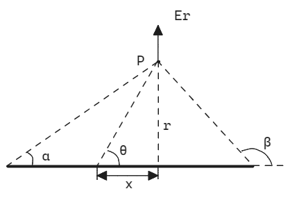

# 电磁学
## 静电学
### 库仑定律与叠加原理

!!! note "库仑定律"

    $$
    \boldsymbol{F_1}=\frac{1}{4\pi\epsilon_0}\frac{q_1q_2}{r_{12}^2}\boldsymbol{e_{21}}=-\boldsymbol{F_2}
    $$

    $\boldsymbol{F_1}$ 是 $q_2$ 作用到 $q_1$ 上的力，$\boldsymbol{e_{21}}$ 是从 $q_2$ 指向 $q_1$ 的单位矢量，$r_{12}$ 是两个点电荷的间距。

    $\epsilon_0$，真空介电常数，测量值为 $8.854\times10^{-12}\rm{C^2/(N\cdot m^2)}$。后面会说明 $\epsilon_0=\frac{1}{4\pi c^2}\cdot 10^7$，其中 $c$ 为光速，这是精确的定义。

- **点电荷：** 理想模型，只有电荷量，没有体积。
- **电荷守恒：** 孤立系统总电荷(净电荷)守恒。
- **叠加原理：** 空间存在多个点电荷时，某点电荷受到的静电力等于其它点电荷各自单独存在时静电力的矢量和。
    $$
    \boldsymbol{F_1}=\sum_{i\neq 1}\frac{1}{4\pi\epsilon_0}\frac{q_1q_i}{r_{1i}^2}\boldsymbol{e_{i1}}
    $$

### 电场与电势
- **电场：** 

    可以定义为作用在某一点处单位电荷的受力，是矢量。以点电荷为例：
    $$
    \boldsymbol{E_1}=\sum_{i\neq 1}\frac{1}{4\pi\epsilon_0}\frac{q_i}{r_{1i}^2}\boldsymbol{e_{i1}}
    $$

- **电势：**  

    静电场是保守场，也就是说电场的第二类曲线积分与路径无关。对于保守场，都可以定义对应的势能。其物理意义为，将单位电荷从参考点 $P_0$ 移动至 $P$ 时，用于克服保守力所做的功。
    $$ 
    \phi(P)=-\int_{P_0}^P\boldsymbol{E}\cdot \mathrm{d}\boldsymbol{s} 
    $$
    其微分形式就是 
    $$
    \boldsymbol{E}=-\nabla\phi=-\left(\frac{\partial \phi}{\partial x}+\frac{\partial \phi}{\partial y}+\frac{\partial \phi}{\partial z}\right).
    $$
    对于点电荷而言，通常定义无穷远为参考点，其电势分布就为

    $$
    \phi(r)=-\int_\infty^r\frac{1}{4\pi\epsilon_0}\cdot\frac{q}{r^2}\mathrm{d}r=\frac{1}{4\pi\epsilon_0}\frac{q}{r}.
    $$

### 高斯定律
- **电通量：** 选定曲面 $\Sigma$ 的一侧，电场对于该曲面的第二类曲面积分的值就是在该曲面上的电通量。
$$
\Phi_E=\iint_\Sigma \boldsymbol{E}\cdot\mathrm{d}\boldsymbol{S}
$$

!!! note "高斯定律"

    $$
    \oiint_\Sigma \boldsymbol{E}\cdot \mathrm{d}\boldsymbol{S}=\frac{q_{enclosed}}{\epsilon_0}
    $$

    对于一个闭合曲面，曲面定向为外侧，则从该闭合曲面出来的总电通量等于该曲面 **内** 的总电荷除以真空介电常数。
    
    **高斯定律与库仑定律：** 

    接下来要证明高斯定律与库仑定律(平方反比律)的等价性。我们只需对单一点电荷作出证明，之后根据电场叠加原理和散度的线性性即可推广到多个点电荷和连续分布电荷的情况。
    
    取一个点电荷和任意一个曲面 $\Sigma$，由数学上的高斯公式可知，
    $$
    \oiint_\Sigma \boldsymbol{E}\cdot \mathrm{d}\boldsymbol{S}=\iiint_\Sigma \nabla\cdot \boldsymbol{E}\ \mathrm{d}V.
    $$
    条件是，$\boldsymbol{E}$ 在 $\Sigma$ 内处处可求偏导。
    如果 $\Sigma$ 内不包含该点电荷，根据球坐标系散度公式

    $$
    \nabla\cdot\boldsymbol{E}=\frac{1}{4\pi\epsilon_0}\cdot\frac{1}{r^2}\frac{\partial}{\partial r}\left(r^2\cdot\frac{1}{r^2}\right)=0,
    $$

    因此有，
    $$
    \oiint_\Sigma \boldsymbol{E}\cdot \mathrm{d}\boldsymbol{S}=0.
    $$
    如果 $\Sigma$ 的 **内部** 包含点电荷，需要绕开 $r=0$ 该点。由于点电荷没有体积，可以取一个半径足够小的球面 $\Sigma'$ 包裹住点电荷，使得球面全部在 $\Sigma$ 内部。
    
    则穿过 $\Sigma'$ 的电通量 
    $$
    \oiint_{\Sigma'} \boldsymbol{E}\cdot \mathrm{d}\boldsymbol{S}=\frac{1}{4\pi\epsilon_0}\frac{q}{r^2}\cdot 4\pi r^2=\frac{q}{\epsilon_0},
    $$
    穿过由 $\Sigma$ 与 $\Sigma'$ 组成的曲面的电通量
    $$
    \begin{aligned}
    \oiint_{\Sigma-\Sigma'} \boldsymbol{E}\cdot \mathrm{d}\boldsymbol{S}&=\oiint_\Sigma \boldsymbol{E}\cdot \mathrm{d}\boldsymbol{S}-\oiint_{\Sigma'} \boldsymbol{E}\cdot \mathrm{d}\boldsymbol{S}\\
    &=\iiint_{\Sigma-\Sigma'}\nabla\cdot\boldsymbol{E}\ \mathrm{d}V\\
    &=0,
    \end{aligned}
    $$
    可以推出 
    $$
    \oiint_\Sigma \boldsymbol{E}\cdot \mathrm{d}\boldsymbol{S}=\oiint_{\Sigma'} \boldsymbol{E}\cdot \mathrm{d}\boldsymbol{S}=\frac{q}{\epsilon_0}.
    $$
    这就是根据库仑定律数学推导出高斯定律。*直观推导先放放。*
    
    又由于 $q=\iiint_\Sigma\rho_e\mathrm{d}V$，结合以上推导可以得到
    $$
    \nabla\cdot\boldsymbol{E}=\frac{\rho_e}{\epsilon_0}.
    $$
    $\rho_e$ 是该点的体电荷密度。这是高斯定律的微分形式，也是麦克斯韦方程组的第一条方程。

## 高斯定律的应用与经典静电场模型
### 线电荷、面电荷与体电荷
#### 线电荷
- **无限长均匀线电荷**

    设线电荷密度为 $\lambda$，取如图所示的圆柱形高斯面，则有，
    $$
    E_r\cdot 2\pi rh=\frac{\lambda\cdot h}{\epsilon_0},
    $$ 
    即可得到径向电场 
    $$
    E_r=\frac{\lambda}{2\pi\epsilon_0 r}.
    $$
    

- **有限长均匀线电荷**

    仅以径向电场为例，其余同理。

    $$
    \begin{aligned}
    \mathrm{d}E_r&=\frac{1}{4\pi\epsilon_0}\cdot\frac{\lambda\mathrm{d}x}{r^2+x^2}\sin\theta=\frac{\lambda r}{4\pi\epsilon_0}\cdot\frac{\mathrm{d}x}{(r^2+x^2)^{\frac{3}{2}}},\\
    E_r&=\frac{\lambda r}{4\pi\epsilon_0}\int_{-x_1}^{x_2}\frac{\mathrm{d}x}{(r^2+x^2)^{\frac{3}{2}}}\\
    &=\frac{\lambda}{4\pi\epsilon_0 r}\left(\frac{x_1}{\sqrt{r^2+x_1^2}}+\frac{x_2}{\sqrt{r^2+x_2^2}}\right)\\
    &=\frac{\lambda}{4\pi\epsilon_0 r}(\cos\alpha-\cos\beta).
    \end{aligned}
    $$

    

#### 面电荷；平行板
- **无限大面电荷**

    由于对称，两侧电场大小相同，方向垂直于电荷平面。设面电荷密度为 $\sigma$， 应用高斯定理可得
    $$
    E=\frac{\sigma}{2\epsilon_0}.
    $$

- **两块平行板间电场**

    叠加或者高斯定理均可得到 
    $$
    E=\frac{\sigma}{\epsilon_0}.
    $$

#### 球体；球壳
对于一个均匀分布有体电荷密度 $\rho$ 的球体，取一个球面作为高斯面，易得电场分布为

$$
E=\left\{
\begin{aligned}
&\frac{\rho r}{3\epsilon_0},&r<R\\
&\frac{\rho R^3}{3\epsilon_0r^2},&r\ge R
\end{aligned}\right.
$$

对于均匀薄球壳的分析是相同的，内部无电场，外部电场分布与点电荷类似。

这些特性事实上都来自于电场的平方反比规律，因此在很多情况下引力场也有类似特性。平方反比规律至少在原子尺度($10^{-10}\mathrm{m}$)下精确成立。

### 导体电场
以下几点是导体(在稳定状态下)的性质：

  - 导体中电荷可以自由移动。
  - 导体内部无电场。
  - 导体表面是等势面(或者说导体上处处等势)。
  - 导体表面的电场处处垂直于导体切面，大小为 $\frac{\sigma_e}{2\epsilon_0}$，$\sigma_e$ 是导体上该点的面电荷密度。
  - **电磁屏蔽**：如果一个导体完全包裹了某个空腔，则外界的任何静止分布的电荷无法在腔内产生电场；同样的，腔内的静电荷分布也无法在导体外部产生任何电场。

这些性质均源于第一条性质，也就是导体中有大量自由电子，其仅受导体形状的约束。因此一旦导体中存在电势差，就会产生电场，进而导致电子的移动，破坏平衡状态。

### 电偶极子
取相距为 $l$ 的两个点电荷 $+q$ 与 $-q$。使用极坐标系，令极轴沿这两电荷的连线，并选取原点在其中间。可以得到电荷的电势为 

$$
\phi(r,\theta)=\frac{1}{4\pi\epsilon_0}\left(\frac{q}{\sqrt{r^2+(l/2)^2-rl\cos\theta}}+\frac{-q}{\sqrt{r^2+(l/2)^2+rl\cos\theta}}\right).
$$

通常而言，我们会研究那些距离远大于电荷间距处的的电场，即 $r\gg l$，则泰勒展开化简得到电势 
$$
\phi(r,\theta)=\frac{1}{4\pi\epsilon_0}\frac{p\cos\theta}{r^2},
$$
式中 $p=ql$，其被定义为**电偶极矩**。

应用极坐标梯度公式可以得到径向与切向电场

$$
\begin{aligned}
\boldsymbol{E}&=-\nabla\phi\\
&=-\left(\frac{\partial\phi}{\partial r}\boldsymbol{e_r}+\frac{1}{r}\frac{\partial\phi}{\partial\theta}\boldsymbol{e_\theta}\right)\\
&=\frac{1}{4\pi\epsilon_0}\frac{p\cos\theta}{r^3}\boldsymbol{e_r}+\frac{1}{4\pi\epsilon_0}\frac{p\sin\theta}{r^3}\boldsymbol{e_\theta}.
\end{aligned}
$$

- ***偶极子在外电场中的行为***

### *电像法
电像法是一种通过等效替代在实空间达到相同电势电场分布的思维与解题方法，它的理论根据是唯一性定理(不做证明)。*普物课程里应当不会讲这种方法，但是在某些考试题目中偶尔会涉及到*，因此姑且讲解两个最基础的模型应付考试即可。

- **点电荷与无穷大导体板**

在一接地无穷大导体平板上方有一点电荷 $q$，则在实空间(点电荷 $q$ 一侧的空间)的电场电势分布等效于有一个镜像电荷 $-q$ 在对称位置，这一对电荷的电场电势分布。$q$ 受到的力就是 $-q$ 对它产生的电场力。像空间(点电荷 $q$ 对侧的空间)的电场由于静电屏蔽，实际为零。

- **点电荷与导体球**

一接地导体球外侧有一点电荷 $q$。电像法实际是模拟相同的电势分布，只要满足镜像电荷与原电荷的等势面恰是该导体球面的形状即可。
假设有一个镜像点电荷在球内，由于导体球电势为零，若满足 $\frac{q}{r_1}+\frac{q'}{r_2}=0$，则这是一个阿波罗尼乌斯圆。调整参数大小使得球心离 $q$ 恰为 $b$，半径恰为 $a$，有镜像电荷 $q'=-\frac{a}{b}q$，离球心距离 $d=\frac{a^2}{b}$。

**注意：**

- 电场分布与电势分布仅在球外的区域成立，球内均为零。
- 如果导体球不接地，比如原本带有电荷 $Q$，则除去镜像电荷 $q'$ 后， 在球心额外有一个电荷 $q''=Q-q'=Q+\frac{a}{b}q$，如此不改变球面等势，也没有改变电荷总量，可以作为等效电荷分布。

## *静电能
### 电荷的静电能
- **两个点电荷：**

    根据先前对点电荷电势的推导，可知将这两个点电荷从相距无穷远移动到相距 $r_{12}$，所要做的功为 
    $$
    \frac{q_1q_2}{4\pi\epsilon_0r_{12}},
    $$ 
    这对电荷的**相互作用能**就为该值。由之后的推导可知，由于点电荷模型的特殊性，点电荷的自能发散，则这个电荷体系的总能量，也就是我们所说的**静电能**(包含自能与相互作用能，不过事实上**不用把自能和相互作用能这二者区分的十分清楚**)，就可以用这个值表征,即 
    $$
    U_{12}=\frac{q_1q_2}{4\pi\epsilon_0r_{12}}.
    $$

- **多个点电荷：**

    对于复数个点电荷，根据叠加原理，总静电能等于所有电荷对的相互作用能之和，如果有 n 个点电荷，则有静电能

    $$
    \begin{aligned}
    U&=\sum_{所有电荷对}\frac{q_iq_j}{4\pi\epsilon_0r_{ij}}\\
    &=\frac{1}{4\pi\epsilon_0}\sum^n_{i=1}\sum^{i-1}_{j=1}\frac{q_iq_j}{r_{ij}}\\
    &=\frac{1}{4\pi\epsilon_0}\cdot\frac{1}{2}\sum^n_{i=1}\left(q_i\cdot\sum^{n}_{j\neq i}\frac{q_j}{r_{ij}}\right)\\
    &=\frac{1}{2}\sum^n_{i=1}\left(q_i\cdot\sum^{n}_{j\neq i}\frac{1}{4\pi\epsilon_0}\cdot\frac{q_j}{r_{ij}}\right)\\
    &=\frac{1}{2}\sum^n_{i=1}q_i\phi_i.
    \end{aligned}
    $$

    其中，$\phi_i$ 是其他点电荷在第 $i$ 个点电荷处的电势和。存在 $\frac{1}{2}$ 的原因是在求和时，每对电荷间的相互作用能被重复考虑了两次。

- **连续分布电荷：**

    对于连续分布电荷的总静电能，根据前面多个点电荷的推导，显然可以过渡到连续形式，

    $$
    \begin{aligned}
    W_e&=\frac{1}{2}\int\phi\mathrm{d}q\\
    &=\frac{1}{2}\iiint\rho_e\phi\mathrm{d}V.
    \end{aligned}
    $$
    
    从积分角度考虑，此时并没有离散情况下 $j\neq i$ 的条件，因此该总能量是包含了相互作用能和“自能”的，但是在此处连续情况与离散情况的静电能计算是**统一**的，这是通过对点电荷能量特殊的定义(也就是忽视点电荷的自能)来实现的，这根本上来自对于能量的定域与点电荷理想模型的**矛盾**，会在下文阐述。

    **注意**这所谓的静电能是针对一个孤立的带电体系而言，如果存在外电场，则能量关系就纠缠不清了，此时对于需要研究的电荷只能说得清它们在外场中的电势能。所以接下来要引入电场能的概念来把静电学中的**能量**概念阐述清楚。

### 电场能
就目前的学习或者观点，我们会倾向于把静电能量定域在电场中，而不是储存在电荷中，这种说法更接近本质。不过在普物中这是完全不需要关心的，因为普物主要考察的是电荷在外场中的电势能，并且这两种说法基本上只是术语和观察角度的不同，在计算结果上一般不会有区别。
从电场的角度来看静电能，对于一个孤立体系，总静电能 
$$
W_e=\frac{\epsilon_0}{2}\iiint_{整个空间}\boldsymbol{E}\cdot\boldsymbol{E}\mathrm{d}V.$$ 其中电场能量密度就是 $$u=\frac{1}{2}\epsilon_0E^2
$$

!!! note "电场能量密度的推导"
    已知两条方程：

    - 静电能方程

    $$
    W_e=\frac{1}{2}\iiint\rho_e\phi\mathrm{d}V
    $$

    - 电荷密度方程

    $$
    \begin{aligned}
    \rho_e&=\epsilon_0\nabla\cdot\boldsymbol{E}=\epsilon_0\nabla\cdot\left(-\nabla\phi\right)\\
    &=-\epsilon_e\nabla^2\phi
    \end{aligned}
    $$

    将第二条方程代入第一条，即可得
    $$
    W_e=-\frac{\epsilon_0}{2}\iiint\phi\nabla^2\phi\mathrm{d}V,
    $$
    使用分部积分做展开

    $$
    \begin{aligned}
    \phi\nabla^2\phi&=\phi\left(\frac{\partial^2\phi}{\partial x}+\frac{\partial^2\phi}{\partial y}+\frac{\partial^2\phi}{\partial z}\right)\\
    &=\frac{\partial}{\partial x}\left(\phi\frac{\partial \phi}{\partial x}\right)-\left(\frac{\partial\phi}{\partial x}\right)^2+\frac{\partial}{\partial y}\left(\phi\frac{\partial \phi}{\partial y}\right)-\left(\frac{\partial\phi}{\partial y}\right)^2+\frac{\partial}{\partial z}\left(\phi\frac{\partial \phi}{\partial z}\right)-\left(\frac{\partial\phi}{\partial z}\right)^2\\
    &=\nabla\cdot(\phi\nabla\phi)-(\nabla\phi)\cdot(\nabla\phi).
    \end{aligned}
    $$

    因此能量积分就为
    $$
    W_e=\frac{\epsilon_0}{2}\iiint(\nabla\phi)\cdot(\nabla\phi)\mathrm{d}V-\frac{\epsilon_0}{2}\iiint\nabla\cdot(\phi\nabla\phi)\mathrm{d}V.
    $$
    利用数学高斯定理，可以将后一个积分转变为面积分
    $$
    \iiint\nabla\cdot(\phi\nabla\phi)\mathrm{d}V=\oiint\phi\nabla\phi\cdot\boldsymbol{n}\mathrm{d}a.
    $$
    假定电荷被约束在有限距离内，将该面积分的高斯面扩展至无穷远(则体积就是对全空间的积分)。取一球面包裹住所有电荷，则 $\phi$ 按 $\frac{1}{r}$ 的速度减小，$\boldsymbol{E}=\nabla\phi$ 按 $\frac{1}{r^2}$ 的速度缩小，而面积 $a$ 按 $r^2$ 的速度增大，则该积分按 $\frac{1}{r}$ 的速度减小，最终会收敛于零。

    因此得到了结果：
    $$
    W_e=\frac{\epsilon_0}{2}\iiint_{全空间}(\nabla\phi)\cdot(\nabla\phi)\mathrm{d}V=\frac{\epsilon_0}{2}\iiint_{全空间}\boldsymbol{E}\cdot\boldsymbol{E}\mathrm{d}V
    $$

### 点电荷的能量
如果把能量定域在电场中，则单个点电荷也会有能量，并且其不存在与其他电荷的相互作用，该能量是他的 **"自能"**。

首先有能量密度
$$
u=\frac{\epsilon_0E^2}{2}=\frac{q^2}{32\pi^2\epsilon_0r^4}
$$
则有总能量
$$
W_e=\int_0^\infty\frac{q^2}{32\pi^2\epsilon_0r^4}\cdot 4\pi r^2\mathrm{d}r=-\frac{q^2}{8\pi\epsilon_0}\left.\frac{1}{r}\right|^{\infty}_0
$$
这显然是发散的。这就说明了把能量定域在电场中的概念与存在点电荷(电子)的假设或者说模型是**相互矛盾**的。一种解决问题的方法是假设电子也依然可以细分成更小的连续分布电荷。另一种可能是，在电子尺度下，经典电学理论已经出现错误。这两种观点都有困难，当然也不必更深入了。

## 电容器与电介质
### 电容、电容器

- **平行极板：**

    
    不考虑边缘效应(事实上在普物里总是不会考虑的)，板内电场大小 $E=\sigma/\epsilon_0$，板外为零。因此板间存在有电势差，也常叫做“电压”，记为 $V$
    $$
    V=Ed=\frac{\sigma}{\epsilon_0}d=\frac{d}{\epsilon_0A}Q，
    $$
    式中 $Q$ 为每块板上的总电荷，$A$ 为板面积，而 $d$ 为板间距离。

    可以发现电压与电荷成正比。对于空间中任意两个导体构成的一个系统，只要两者带**等量异种电荷**，$V$ 与 $Q$ 间的正比性就存在。这种正比性源于叠加原理，导体间电荷相互吸引导致电荷分布形式总是相同的，仅有电荷量的差别，因此电荷加倍，电场也加倍，电势差也就是电场对路径的积分也加倍，则有电压与电荷成正比。可以写成
    $$
    Q=CV,
    $$
    式中比例常数 $C$ 也就是电容，这样一种两个导体的系统就称为电容器。不过其实电容器的要求并不如此严苛，事实上核心就是一种施加电压来储存电荷的装置，对于封闭性、导体个数都没有严格定义。

- **孤立导体球：**

    对于一个孤立导体球，其另一块极板可以看作无穷远处，或者设想有一个半径无限大的导体球(大地)。导体球电势为
    $$
    V=\frac{Q}{4\pi\epsilon_0R},
    $$
    则有电容
    $$
    C=\frac{Q}{V}=4\pi\epsilon_0R.
    $$

- **同轴电缆：**

    

    如图，电容器由两个同轴柱形导体组成，长度远大于两者半径，设导体上线电荷密度为 $\lambda$，内侧为正，外侧为负。显然由高斯定理，取圆柱形高斯面可以解得导体间空腔电场为 $E=\frac{\lambda}{2\pi\epsilon_0r}$，沿轴向分布。两圆柱电极间电压为
    $$
    V=\int_A^B\boldsymbol{E}\cdot\mathrm{d}\boldsymbol{r}=\int_{R_A}^{R_B}\frac{\lambda}{2\pi\epsilon_0}\cdot\frac{1}{r}\mathrm{d}r=\frac{\lambda}{2\pi\epsilon_0}\ln\frac{R_B}{R_A}.
    $$
    电容器一个电极上储存的总电荷为 $Q=\lambda L$，故同轴电缆的电容公式为
    $$
    C=\frac{Q}{V}=\frac{2\pi\epsilon_0L}{\ln\frac{R_B}{R_A}}.
    $$

- **同心球型电容：**

    同样的分析，电容器由两个同心球型导体A和B组成，设半径分别为 $R_A$ 和 $R_B(R_A<R_B)$。
    其各自带有电荷 $\pm Q$，则导体间电场 $E=\frac{Q}{4\pi\epsilon_0r^2}$。两电极间电压就为
    $$
    V=\int_{R_A}^{R_B}\frac{Q}{4\pi\epsilon_0}\frac{1}{r^2}\mathrm{d}r=\frac{Q}{4\pi\epsilon_0}\frac{R_B-R_A}{R_AR_B}.
    $$
    电容就为
    $$
    C=\frac{Q}{V}=\frac{4\pi\epsilon_0R_AR_B}{R_B-R_A}.
    $$

### 电容器储能
考虑电源对一个不带电的电容器的充电过程，则电源对它做的功就是电容器储能。

已知当电容器带电 $Q$ 时，有电压 $V=\frac{Q}{C}$。充电过程就是逐步把电荷微元 $\mathrm{d}Q$ 从负极板移动到正极板，则转移电荷过程做功
$$
\mathrm{d}W=V\mathrm{d}Q=\frac{Q}{C}\mathrm{d}Q，
$$
从零电荷积分到最后带电荷 $Q$，就有总功
$$
W=\frac{1}{2}\frac{Q^2}{C}.
$$
这就是电容器储能公式，分别有三种形式，题目通常只给出电压和电容，因此第二个形式用的比较广泛，不过三者是完全等价的。
$$
W_e=\frac{1}{2}\frac{Q^2}{C}=\frac{1}{2}CV^2=\frac{1}{2}QV.
$$

- 电容器储能与电场能

    考虑最简单的平行板电容器，其储能 
    $$
    W_e=\frac{Q^2}{2C}=\frac{Q^2d}{2\epsilon_0A}.
    $$
    由于仅平行板间存在电场(不考虑边缘效应)
    $$
    E=\frac{\sigma}{\epsilon_0}=\frac{Q}{\epsilon_0A},
    $$
    可以发现储能与电场的关系
    $$
    W_e=\frac{(E\cdot\epsilon_0A)^2d}{2\epsilon_0A}=\frac{1}{2}\epsilon_0E^2Ad.
    $$
    由于电容器体积 $V=Ad$，因此亦可得到电场能密度
    $$
    u=\frac{1}{2}\epsilon_0E^2.
    $$
    这也是静电能储存在电场中的一个佐证。

- ***电容器的串并联***

### 电介质
该部分相对而言容易考解答题，并且一部分概念相当容易混淆，建议将该章节完整看完，再找历年题做一下相应的题目(基本是大题)。

#### 极化微观机理
- 导体：可以“无限”提供被约束在内部的自由电子的一类物体。其微观实质是，许多电子不被原子核约束，而可以在导体中自由移动。
- 绝缘体(或者说电介质)：所有电子都被束缚于特定的原子或者分子，只能产生微小的位移。这种位移可以解释电介质的电学特性，也就是所谓的**极化**。

极化本质上就是正负电荷中心发生偏移导致产生电场的过程，不过从微观上会有两种不同机制导致极化：电荷偏移或者极性分子的旋转。接下来会粗略地讲解这两种机制以帮助理解宏观上极化现象的本质。

- 无极分子和原子的位移极化：

    当中性的原子放置在外电场中，带正电的原子核会沿电场方向移动，带负电的电子云则会向着相反方向，两者位移一定距离后重新平衡，此时正负电荷中心不重合，原子**被极化**。此时原子产生了一个微小的偶极矩 $\boldsymbol{p}$，其与电场 $\boldsymbol{E}$ 同向。如果电场足够大，可以电离原子，使得电子脱离原子核成为自由电子，宏观上表现为电介质被“击穿”成为导体。

- 极化分子的取向极化：

    某些分子本身正负电荷中心就并不重合，具有固有偶极矩，被称为极化分子。例如水分子的氢原子和氧原子三者并不排列在一条直线上，导致正负电荷中心存在固有偏移。当它被放置在外电场中时，偶极子会受到力矩
    $$
    \boldsymbol{M}=\boldsymbol{p}\times\boldsymbol{E},
    $$
    使得其倾向于向着电场方向转动。原本方向无序的一大团分子在外电场作用下有序排列，表现在宏观上也就是发生了极化。

两种机制表现在宏观上的效果是类似的，最终都表现为一侧带有负电，另一侧带有正电，中间产生能一定程度上抵消外电场的反向电场。

#### 极化强度
为了从宏观上描述电介质内的极化状况，需定义一个矢量 $P$，其物理含义为单位体积内偶极矩的矢量和，即
$$
\boldsymbol{P}=\frac{\sum \boldsymbol{p}}{\Delta V}.
$$
这被称作**极化强度矢量**。接下来会研究极化强度矢量与原电场以及电介质的宏观属性之间的关系。

- **极化电荷**

    电介质被极化后的束缚电荷都是真实的会产生电学效应的电荷，需要计算这些电荷分布与极化强度之间的关系。考虑一个平行于 $\boldsymbol{P}$ 的微小圆柱，面积为 $A$，厚度为 $d$。则根据极化强度的定义，其偶极矩就为 $P\cdot (Ad)$。假设一端的电荷量为 $q$，由于偶极矩就为 $qd$，则有 $q=PA$，因此**表面**的电荷面密度就为
    $$
    \sigma'=\frac{q}{A}=P
    $$
    
    如果截面与极化强度矢量有夹角 $\theta$，则电荷依然相同，但是截面面积增大，有 $A_{end}=A/\cos\theta$，所以有极化面电荷密度与极化强度矢量的关系
    $$
    \sigma'=\frac{q}{A_{end}}=P\cos\theta=\boldsymbol{P}\cdot\boldsymbol{\^{n}}
    $$
    注意，在**均匀极化**情况下，即极化强度矢量处处相等时，内部的正负电荷会相互“抵消”，造成的效果就是只在电介质表面产生面电荷密度。如果是非均匀极化情况，还可能在电介质内部产生体电荷密度分布。

    依然是取一个高斯面 $S$，则正束缚电荷会被排挤到曲面外，因此有内部的净电荷
    $$
    \Delta Q_{极化}=-\oiint \sigma'\mathrm{d}S=-\oiint \boldsymbol{P}\cdot\mathrm{d}\boldsymbol{S}.
    $$
    
    又有 $\Delta Q_{极化}=\iiint\rho'\mathrm{d}V$，再用高斯定理可得
    $$
    \iiint\rho'\mathrm{d}V=-\oiint \boldsymbol{P}\cdot\mathrm{d}\boldsymbol{S}=-\iiint (\nabla\cdot \boldsymbol{P})\mathrm{d}V,
    $$
    由于对任意体积成立，就有结果
    $$
    \rho'=-\nabla\cdot\boldsymbol{P}.
    $$
    需要强调，这些电荷都是**真实**的电荷密度，只是为了区分来源，才叫做“极化电荷”或者“束缚电荷”。

#### 含电介质时的静电方程组
!!! note "含电介质的高斯定理推导"
    电介质中除了束缚电荷会产生电场，还可能有导体的电荷、嵌入电介质的离子或者其他电荷(统称自由电荷)会引起电场并参与静电方程组。因此在电介质中的总电荷可以写作
    $$
    \rho=\rho_0+\rho'.
    $$
    式中 $\rho_0$ 就为自由电荷体密度，$\rho'$ 就为束缚电荷，而 $\rho$ 则是总电荷。

    因此高斯定理就可以写作
    $$
    \epsilon_0\nabla\cdot\boldsymbol{E}=\rho=\rho_0+\rho'=\rho_0-\nabla\cdot\boldsymbol{P}.
    $$
    **注意**，式中的 $\boldsymbol{E}$ 是总电场，而非初始外电场或者束缚电荷产生的退极化场。

    将散度项合并可以发现
    $$
    \nabla\cdot(\epsilon_0\boldsymbol{E}+\boldsymbol{P})=\rho_0.
    $$
    将括号中的表达式用字母 $\boldsymbol{D}$ 表示
    $$
    \boldsymbol{D}=\epsilon_0\boldsymbol{E}+\boldsymbol{P}.
    $$
    其被称为**电位移矢量**。这样就得到了有电介质时的高斯定理
    $$
    \nabla\cdot\boldsymbol{D}=\rho_0.
    $$
    积分形式即为
    $$
    \oiint\boldsymbol{D}\cdot\mathrm{d}\boldsymbol{S}=Q_0.
    $$
    式中 $Q_0$ 就是体积内的总自由电荷，而自由电荷可控，并且通常会直接在题目中给出。因此在对称性好得时候，$\boldsymbol{D}$ 是容易求得的。

**但是**，需要强调的是，电位移矢量仅仅是为了便于求解存在电介质情况下的静电分布而引入的数学符号，它本身不具有电场的大多数性质。比如，对于电位移矢量而言，库仑定律不一定成立，并且环路积分也不一定为零，因此也没有“势”的概念。

接下来要引入电位移矢量与电场和极化强度之间的关系。

#### 电极化率、介电常数
实验发现，当电场并不特别强时，极化强度与电场成正比
$$
\boldsymbol{P}=\epsilon_0\chi_e\boldsymbol{E}.
$$
式中 $\chi_e$ (读音kai)被称为**电极化率**，满足该关系的被称为线性电介质。事实上 $\chi_e$ 是一个张量，

$$
\begin{pmatrix}
    P_x \\
    P_y \\
    P_z
\end{pmatrix}=
\begin{pmatrix}
    \chi_{xx} & \chi_{xy} & \chi_{xz} \\
    \chi_{yx} & \chi_{yy} & \chi_{yz} \\
    \chi_{zx} & \chi_{zy} & \chi_{zz}
\end{pmatrix}
\begin{pmatrix}
    \epsilon_0E_x \\
    \epsilon_0E_y \\
    \epsilon_0E_z
\end{pmatrix}
$$

不过通常题目遇见的都是各向同性的，即并不需要考虑方向，电极化率是常数。

依然需要强调的是，式中 $\boldsymbol{E}$ 是总电场，即外电场与束缚电荷产生电场的叠加。我们可以通过电位移矢量来得到电场与极化强度分布。

在线性电介质中
$$
\boldsymbol{D}=\epsilon_0\boldsymbol{E}+\boldsymbol{P}=\epsilon_0(1+\chi_e)\boldsymbol{E}.
$$
定义一个新的物理量 $\kappa_e$，
$$
\kappa_e=1+\chi_e,
$$
就有电位移矢量与电场关系
$$
\boldsymbol{D}=\kappa_e\epsilon_0\boldsymbol{E}.
$$
这个常数被称作该材料的相对介电常数。令 $\epsilon=\kappa_e\epsilon_0$，其被称为该材料的介电常数。三个常数只用知道一个就可以得到另外两个，不过是 $\chi_e$ 用在极化强度，而 $\kappa_e$ 用在电位移矢量罢了。

有了以上关系，就足以求解电介质中的电场电荷分布了。

#### 线性电介质举例
- **电介质球壳**
    半径为 $a$ 的金属球带电荷量为 $Q$，被一个相对介电常数 $\kappa_e$ 且外径为 $b$ 的线性电介质包裹。

    

    先计算电位移矢量，由于自由电荷量就为 $Q$，使用含电介质高斯定理易得
    $$
    \boldsymbol{D}=\frac{Q}{4\pi r^2}\boldsymbol{\^{r}}.
    $$
    其对于 $r>a$ 处恒成立。再根据电场与电位移矢量的关系可得

    $$
    \boldsymbol{E}=\left\{
    \begin{aligned}
    &\frac{Q}{4\pi\kappa_e\epsilon_0r^2}\boldsymbol{\^{r}},& a<r<b\\
    &\frac{Q}{4\pi\epsilon_0r^2}\boldsymbol{\^{r}},& r > b
    \end{aligned}\right.
    $$

    自然也可以计算电介质中的极化强度(虽然没必要)。
    $$
    \boldsymbol{P}=(\kappa_e-1)\epsilon_0\boldsymbol{E}=\frac{(\kappa_e-1)Q}{4\pi\kappa_er^2}\boldsymbol{\^{r}}
    $$

- **均匀极化球**
    这是一个经典模型，一个电介质球在外电场 $\boldsymbol{E}$ 中被均匀极化，求介质球中的电场、极化强度与面电荷分布。

    

    图中直观地展示出束缚电荷在外场中的极化情况，也就是正负电荷中心偏移，可以用两个均匀带电球来表征或者说**模拟**。没有极化时，两个球重合；当介质球被均匀极化后，两个球产生微小的偏移 $d$，因而在球中间相互抵消，而表面产生面电荷。

    假设体电荷密度为 $\rho_e$，则一个球上的总电荷量为 $Q=\rho_e\cdot\frac{4}{3}\pi R^3$。由高斯定理易得在均匀带电球内的电场为
    $$
    \boldsymbol{E} = \frac{\rho_e}{3\epsilon_0}\boldsymbol{r}, 
    $$
    则有两球叠加产生的电场
    $$
    \boldsymbol{E'} = \frac{\rho_e}{3\epsilon_0}\boldsymbol{r_1}+\frac{-\rho_e}{3\epsilon_0}\boldsymbol{r_2}=-\frac{\rho_e}{3\epsilon_0}\boldsymbol{d}.
    $$
    又由极化强度的定义
    $$
    \boldsymbol{P} = \frac{\sum \boldsymbol{p}}{\Delta V} = \frac{Q\boldsymbol{d}}{\frac{4}{3}\pi R^3} = \rho_e \boldsymbol{d}.
    $$
    因此得到了此处所谓“**退极化场**”与极化强度的关系
    $$
    \boldsymbol{E'} = -\frac{\boldsymbol{P}}{3\epsilon_0}.
    $$
    课堂上应该对退极化场的概念有所讲述，它是在电介质极化后，束缚电荷产生的反向电场。作用上它会使得电介质内场强减小，但由于极化强度本身与电场有正比关系，所以也就导致极化效果减弱，这就是“退极化”的由来。不过事实上退极化场并不重要，也不参与到前文静电方程组中，此处提出这个概念仅仅方便解题。

    需要注意的是，电介质球自然不会是两个均匀带电球的叠加，此处仅仅用来模拟，仅因为二者的电场与电荷分布相同罢了。

    介质球表面的面电荷密度分布也很简单，
    $$
    \sigma_e' = \boldsymbol{P}\cdot\^{n} = P\cos\theta = \rho_e d \cos\theta.
    $$
    如果再引入外场 $\boldsymbol{E_0}$，假设相对介电常数为 $\kappa_e$，则有关系
    $$
    \boldsymbol{E} = \boldsymbol{E_0} + \boldsymbol{E'},
    $$
    以及
    $$
    \boldsymbol{P} = \epsilon_0(\kappa_e-1)\boldsymbol{E} = -3\epsilon_0\boldsymbol{E'}.
    $$
    联立就可以解得总电场
    $$
    \boldsymbol{E} = \frac{3}{\kappa_e+2}\boldsymbol{E_0}.
    $$

## 稳恒电流

## 静磁学

## 电磁感应

## 麦克斯韦方程组

## 电磁波